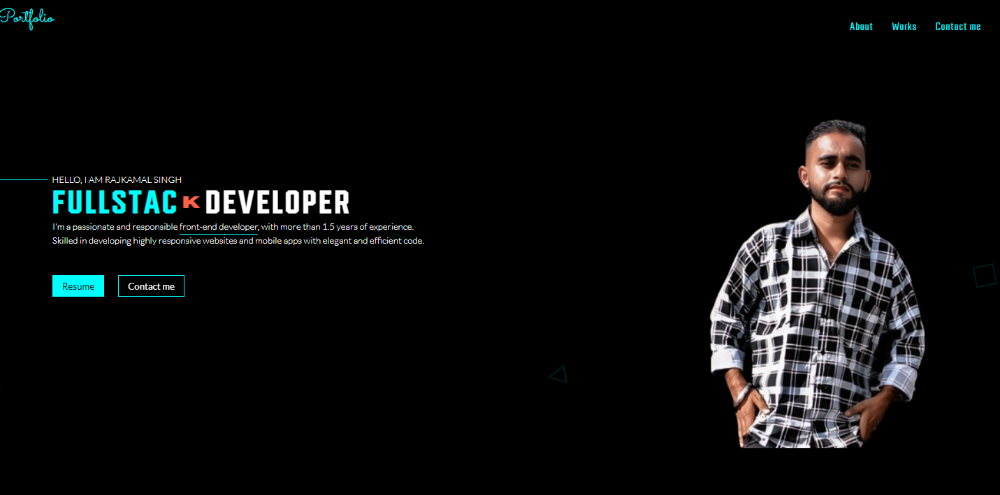
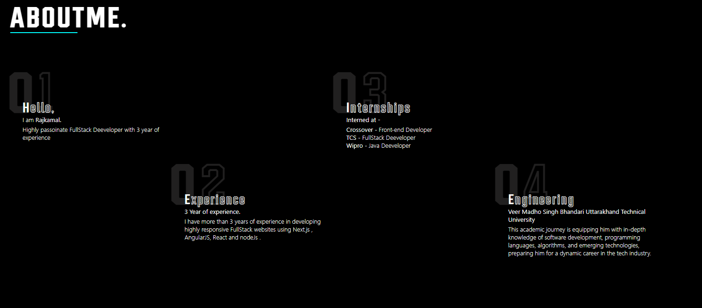

<div align="center">

  <a href="https://github.com/mrCoderPj04">
    
  </a>

  # 🚀 Rajkamal Singh — Personal Portfolio

  <p align="center">
    <b>Senior AI Engineer & Full-Stack Developer</b><br/>
    📍 Chamoli, Uttarakhand, India 🇮🇳 &nbsp;|&nbsp; ✉️ <a href="mailto:mrcoder04@outlook.com">mrcoder04@outlook.com</a>
  </p>

  <p align="center">
    <a href="https://rajkamal-singh.netlify.app"></a>
    <a href="https://github.com/mrCoderPj04"></a>
    <a href="https://www.linkedin.com/in/rajkamal-singh-8693aa2b3/"></a>
    <a href="https://api.web3forms.com"></a>
  </p>

  <h3>🌐 Live Website: <a href="https://rajkamal-singh.netlify.app">https://rajkamal-singh.netlify.app</a></h3>

</div>

---

## 📸 Portfolio Preview & Screenshots

<div align="center">
  <p><b>Hero & Navigation View</b></p>
  
  <br/><br/>
  <p><b>Categorized Works & Portfolio Experience View</b></p>
  
</div>

---

## 📖 Overview

Welcome to the personal developer portfolio of **Rajkamal Singh** ([@mrCoderPj04](https://github.com/mrCoderPj04)). Live production deployment is hosted at [https://rajkamal-singh.netlify.app](https://rajkamal-singh.netlify.app).

This portfolio showcases open-source repositories, engineering experience, technical skills, internships, and dynamic GitHub API integration.

### ✨ Key Features

- 🌐 **Live Netlify Deployment**: Access the live portfolio anytime at [https://rajkamal-singh.netlify.app](https://rajkamal-singh.netlify.app).
- 👤 **Dynamic GitHub Avatar Integration**: Real-time profile picture sync direct from GitHub (`https://github.com/mrCoderPj04.png`).
- 📁 **Categorized GitHub Repositories**: Filter GitHub projects by category:
  - 🌐 *Full-Stack & Web* (`JourneyJunction`, `Be_fit`, `PjStream`, `PJSOFONIC`, `Sofo_SyC`, `Sofo_learning`)
  - 📊 *Dashboards & ERP* (`PjDashConnect`, `pjsofonic-ms-dashboard`, `PJSPFPNIC_erp`)
  - 🐍 *Python & AI* (`billl_recipt_genrstor_pyPro`)
  - ☕ *Java & Systems* (`App-03`, `My-cpp-code`)
  - 🎨 *UI & Utilities* (`img-editor`, `Chat-box`, `AboutCard`)
- 📨 **Fully Functional Web3Forms Contact Form**: Direct email delivery using Web3Forms API key (`640155b4-8d22-4643-9df3-b2ce27e7564d`) with loading states and instant success notifications.
- ⚡ **Responsive Modern UI**: Neon dark theme, smooth micro-animations (AOS), glassmorphism design, and 3D skill cloud sphere (TagCloud).
- 🌐 **Netlify Production Ready**: Pre-configured with `_redirects` and `netlify.toml` for Single Page Application (SPA) client-side routing.

---

## 🛠️ Tech Stack

- **Frontend Framework**: React 18, React Router v6, Sass/SCSS, FontAwesome Icons, TagCloud 3D, AOS (Animate on Scroll)
- **Styling**: SCSS / BEM Methodology, Neon Dark Theme, HSL Modern Color Tokens
- **Email Service**: Web3Forms API (`640155b4-8d22-4643-9df3-b2ce27e7564d`)
- **Deployment & Hosting**: [Netlify Live](https://rajkamal-singh.netlify.app)

---

## 💻 Local Development Setup

Follow these steps to run the application locally:

### 1. Clone Repository
```bash
git clone https://github.com/mrCoderPj04/Rajkamal_Singh.git
cd Rajkamal_Singh
```

### 2. Install Dependencies
```bash
npm install
```

### 3. Start Development Server
```bash
npm start
```
Open [http://localhost:3000](http://localhost:3000) in your browser.

### 4. Build Production Bundle
```bash
npm run build
```

---

## 🌐 Netlify Deployment Status

- **Live URL**: [https://rajkamal-singh.netlify.app](https://rajkamal-singh.netlify.app)
- **Build Settings** (Configured in `netlify.toml`):
  - **Build Command**: `npm run build`
  - **Publish Directory**: `build`
  - **Redirect Rules**: `/* /index.html 200` (Handled via `public/_redirects` & `netlify.toml`)

---

## 📬 Contact & Socials

- 🌐 **Live Website**: [https://rajkamal-singh.netlify.app](https://rajkamal-singh.netlify.app)
- ✉️ **Email**: [mrcoder04@outlook.com](mailto:mrcoder04@outlook.com) / [rajkamalsingh6959@gmail.com](mailto:rajkamalsingh6959@gmail.com)
- 🐙 **GitHub**: [github.com/mrCoderPj04](https://github.com/mrCoderPj04)
- 💼 **LinkedIn**: [linkedin.com/in/rajkamal-singh-8693aa2b3](https://www.linkedin.com/in/rajkamal-singh-8693aa2b3/)
- 📍 **Location**: Dogari Kandai PO Tangsha, Chamoli, Uttarakhand 246401 🇮🇳

---

<p align="center">
  <i>"Whatever you are doing, do it with absolute dedication and silently; just watch - one day you will become the owner of your dream."</i>
</p>
